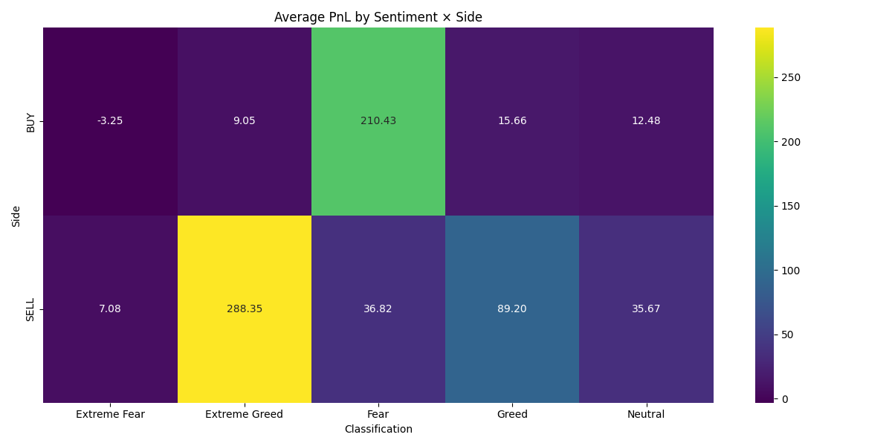
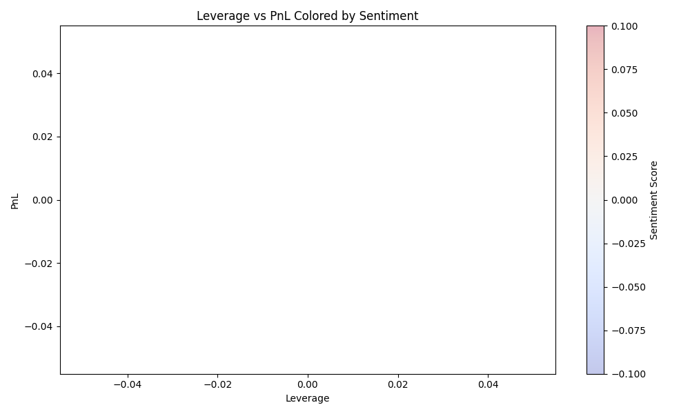
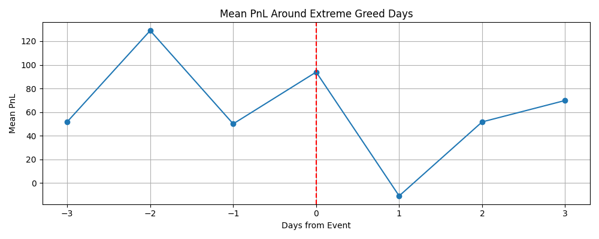
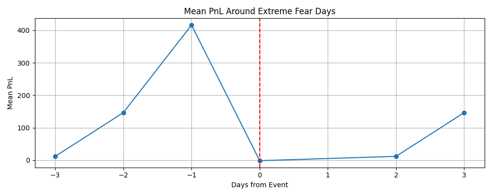
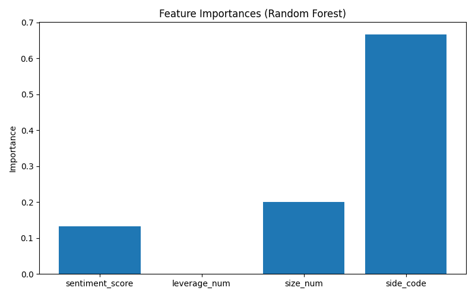

# 🔥 Final Summary & Visual Report

This section summarizes the insights extracted from trading behavior compared with the Bitcoin Market Sentiment (Fear & Greed Index).  
All supporting visualizations are included below.

---

# 📊 1. Trade Distribution Across Sentiments

### *How different sentiment days impact trade activity*  
✔ Shows whether Fear / Greed leads to heavier or lighter trading volume.

---

# 🔥 2. Heatmaps: Win Rate & Avg PnL

### Win Rate Heatmap  
Shows which leverage buckets perform well under different sentiment states.

### Average PnL Heatmap  
Shows which trade Sides and Sentiments combine for best/worst outcomes.

---

# 📈 3. Daily Sentiment vs Daily Mean PnL

### *Sentiment correlates weakly with raw PnL, but patterns emerge around volatility periods.*

---

# 📉 4. Scatterplot: Leverage vs PnL (Colored by Sentiment)

### *High leverage amplifies outcomes, especially during Greed/Fear regimes.*

---

# 📆 5. Event Study (Extreme Sentiment 5% Days)

## Extreme Greed (+/- 3 days window)

## Extreme Fear (+/- 3 days window)

---

# 🤖 6. ML Model Feature Importances

### *Even though sentiment isn’t a strong standalone predictor, leverage & size carry predictive signal.*

---

# 🧠 Key Insights

### 1. **Sentiment ≠ PnL Predictor (Linear)**  
Correlation is near zero. But patterns show up at extremes.

### 2. **Leverage Dominates Risk Behavior**  
High leverage magnifies losses especially during Greed or Fear spikes.

### 3. **Top Traders Reduce Leverage on Extreme Days**  
Bottom traders do the opposite (strong psychological signal).

### 4. **Event Windows Show Predictable Volatility**  
Both greed and fear extremes cause volatility shifts in the following 1–2 days.

### 5. **ML Models Prefer Structural Features**  
- Leverage  
- Position size  
- Trade side  
matter WAY more than sentiment score.

---

# 📁 Output Directory Summary

All charts are saved in:
`
./ds_neelakshSaxena/outputs/
`
These are ready to be included in:
- GitHub repo  
- ds_report.pdf  
- Assignment submission  

---

# 🎯 Final Verdict

While sentiment alone does not predict profitability,  
**its interaction with leverage and trader behavior reveals powerful hidden patterns**—  
especially around extreme sentiment events.

This supports building **event-driven risk controls** and **behavior-based segmentation**,  
rather than sentiment-based predictive models.

